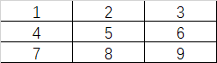
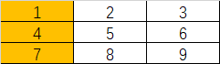
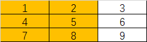
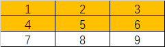
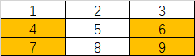
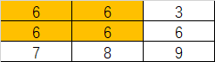
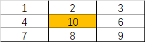

# Numpy

### 实验名称

Numpy基本使用

### 实验目的

通过该实验的实践，要求学生可以掌握不同维度数组的表示形式，熟悉ndarray的属性和基本操作，能够使用Numpy进行数组的运算、统计和数据存取等操作

### 实验背景

NumPy(Numerical Python) 是 Python 语言的一个扩展程序库，支持大量的维度数组与矩阵运算，此外也针对数组运算提供大量的数学函数库，有助于学生学习数据科学或者机器学习。

### 实验原理

NumPy 是一个运行速度非常快的数学库，主要用于数组计算，包含：

* 一个强大的N维数组对象 ndarray

* 广播功能函数

* 整合 C/C++/Fortran 代码的工具

* 线性代数、傅里叶变换、随机数生成等功能

### 实验环境

Ubuntu 16.04

Python 3.6

Numpy 1.17.4

### 建议课时

1课时

### 实验步骤

#### 数组构造

由列表构造数组

l = [1,2,3]

```python
```

由元组构造数组

t = (1,2,3)

```python
```

由上述列表和元组构造成两行三列的二维数组

```python
```

构造一个任意的等差数列(指定起始区间和公差)

```python
```

构造一个任意的等差数列(指定起始区间和区间内元素格式)

```python
```

#### 数组属性



查看数组的形状

```python
```

查看数组维数

```python
```

查看数组的元素个数

```python
```

查看数组的元素类型

```python
```

查看数组的元素大小(字节数)

```python
```

#### 切片

##### 列表切片

编写代码，从二维列表中取出取出黄色背景中的元素



```python
```

编写代码，从二维列表中取出取出黄色背景中的元素



编写代码，从二维列表中取出取出黄色背景中的元素

```python
```



编写代码，从二维列表中取出取出黄色背景中的元素

```python
```



##### Array切片

编写代码，从数组中取出取出黄色背景中的元素


```python

```

编写代码，从数组中取出取出黄色背景中的元素


```python

```

编写代码，从数组中取出取出黄色背景中的元素


编写代码，从数组中取出取出黄色背景中的元素

```python

```


#### 修改元素值


##### 列表

编写代码，修改为以下值



```python
```

##### Array

编写代码，修改为以下值


```python

```

#### 其他运算

##### 比较运算

编写代码，判断各元素的值是否等于5


```python
```

##### 布尔索引

根据上述结果，筛选出比较结果为True(值==5)的元素

```python

```

##### 借助布尔索引重新赋值



```python
```

#### 数组类型转换

Numpy数组中只能够存储相同数据类型的元素。


##### 将整数数组转为小数数组

```python
```

#### 数组统计计算


计算数组中的最大值

```python
```

计算数组中的最小值

```python
```

计算所有元素的和

```python
```

计算所有元素平均值

```python
```

对每行数据求和

```python
```

### 实验总结

在实验中，通过对Numpy各种基本操作的实践练习，加深了学生对Numpy数据结构及其功能的理解，为以后学习和工作中Numpy的使用提供指南。
